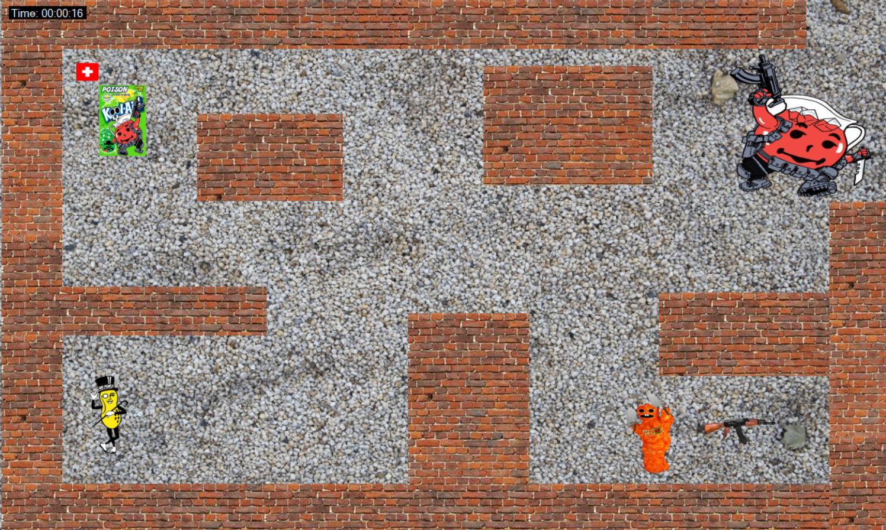
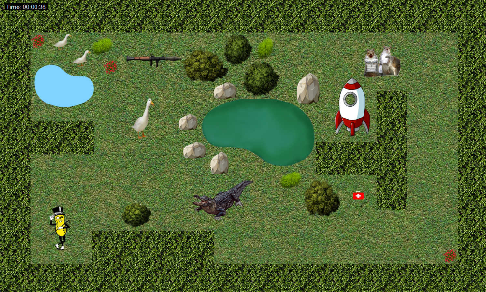

Levels
======

Creation
--------
Each level is creating using ``Character`` objects. The player, enemies, walls, and 
obstacles are created using the ``Character`` object. Each ``Character`` has 
``Position`` and ``Collider`` objects. To create the level, the walls, enemies, and 
obstacles are added to the Form. 

.. warning::
    When creating new levels, ensure that the character count is small to avoid memory
    issues. Out of memory errors occur if there are more than rougly ~30 ``PictureBox`` 
    objects in a single form.

Game State
----------
The ``GameState`` object was created to store objects and information needed between
levels. The ``GameState`` object contains the following objects and information:

- ``player`` (``Player``): The player object of the game
- ``timeStart`` (``DateTime``): The time object to hold the amount of playtime of the game
- ``isLevelOneCompleted`` (``bool``): An object to store the completeness status of Level 1
- ``isLevelTwoCompleted`` (``bool``): An object to store the completeness status of Level 2
- ``isLevelThreeCompleted`` (``bool``): An object to store the completeness status of Level 3
- ``startGame`` (``bool``): The object to store the start status of the game
- ``isGamePaused`` (``bool``): The object to store the completeness status of Level 1
- ``currentLevel`` (``Level``): The object to store the current level of the game 

Level 1
-------
The first level is a backstreet alley with a food related enemies. The player needs to 
defeat surrounding enemies to prepare for the boss battle. Once the player defeats the
boss, then they will be teleported to the next level through a portal. There are items
for the player to use after defeating the enemies. The enemies for the first level are
listed below:

- Kool-Aid Poison Packet
   - Health: 30
- Flaming Hot Cheeto
   - Health: 20
- Boss Kool-Aid
   - Health: 70

Level 2
-------

The second level is a friendly park with ponds, trees and park-related enemies. To get
through the level, the player needs to navigate their way through the park, avoid 
obstacles, and fight the enemies to proceed to the next level. The enemies in this level
are listed below:

- Angy Goose
   - Health: 20
- Alligator
   - Health: 50
- Boss Rough Rodents
   - Health: 100

Level 3
-------
The third level is an Among Us themed map with imposters. To get through the level and 
win the game, the player needs to navigate through the cafeteria, fight the imposters and
eject them from the ship. The enemies in this level are listed below:

- Blue Imposter
   - Health: 20
- White Imposter
   - Health: 50
- Boss Imposter
   - Health: 100

